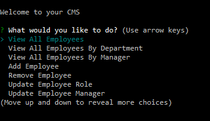
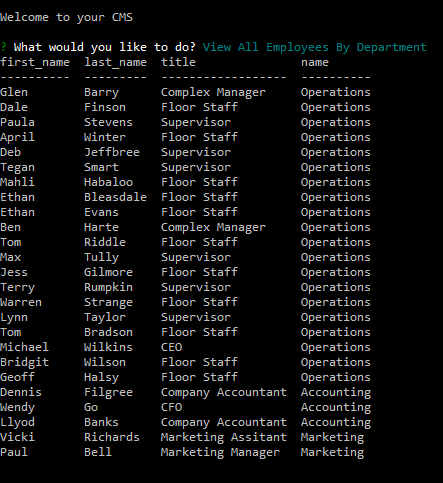

# Employee CMS
### By trojanface

## Description
A Content Management System for a company's employee records.

## Table of Contents

1. Description
2. Contents
3. Screenshot
4. Installation
5. Usage
6. License
7. Contributors
8. Profile

## Installation
1. npm install

## Usage
1. node app.js

## License
Public Domain

## Contributors
trojanface

